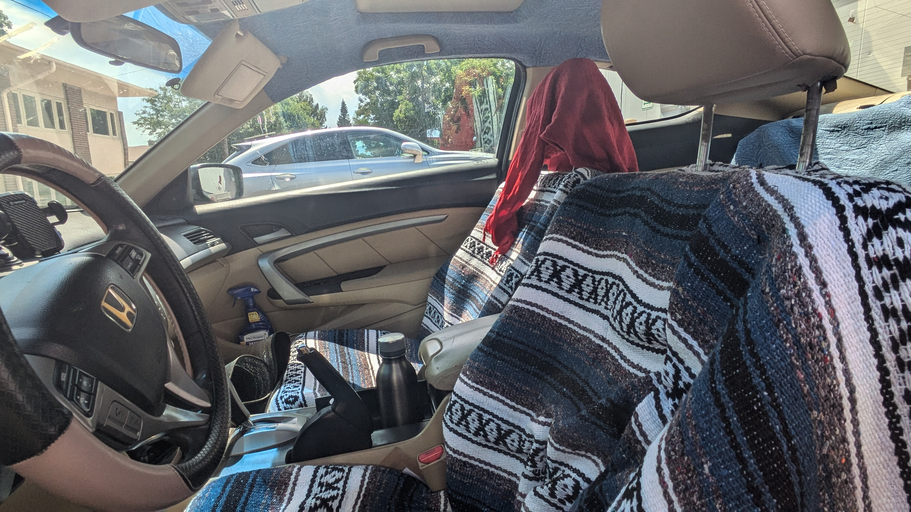

+++
title =  "Baja Seat Covers"
description = "Covering up the worn out with rugs"
author = "Justin Napolitano"
tags = ["lifestyle", "DIY','Car']
categories = ['DIY']
images = ["images/feature-image.png"]
date = "2024-07-09"
+++

# Baja Seat Covers

So my car is ready for some new seat covers. I am not going to spend the money to replace the original ones. It doesn't make sense. So I am going to cover them with blankets and hope for the best. 

## The plan

I am going to drape them over the front seats and cut some holes for the head rest to pass through.  Then I will sew the seat covers together (probably) to keep them from moving around. Then I will flip them inside out and call it day. 

## The Outcome

Okay so it looks pretty umm diy.. but so does the rest of the car. 

